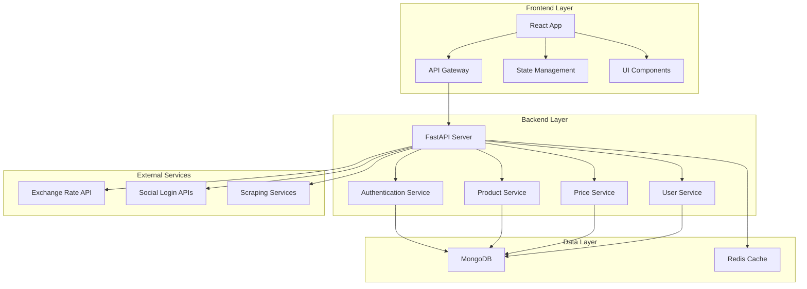

# 아키텍처 설계 문서

## 📋 목차
- [시스템 개요](#시스템-개요)
- [기술 스택](#기술-스택)
- [아키텍처 다이어그램](#아키텍처-다이어그램)
- [모듈 구조](#모듈-구조)
- [데이터베이스 설계](#데이터베이스-설계)
- [인증 시스템](#인증-시스템)
- [API 설계](#api-설계)
- [보안 정책](#보안-정책)
- [성능 최적화](#성능-최적화)
- [모니터링](#모니터링)

## 🎯 시스템 개요

### 프로젝트 목적
- 상품 데이터 수집 및 가격 설정 자동화 시스템
- 다중 플랫폼(쿠팡, 네이버, 11번가 등) 상품 관리
- 실시간 환율 연동 및 마진 계산

### 핵심 기능
- 상품 데이터 스크래핑
- 가격 설정 및 마진 계산
- 다중 플랫폼 상품 등록
- 사용자 인증 및 권한 관리

## 🛠 기술 스택

### Frontend
- **Framework**: React 18 + TypeScript
- **Build Tool**: Vite
- **State Management**: Jotai
- **Routing**: React Router v6
- **Styling**: CSS Modules
- **HTTP Client**: Axios
- **Form Management**: React Hook Form + Zod

### Backend
- **Framework**: FastAPI (Python 3.11+)
- **Database**: MongoDB
- **Authentication**: JWT + OAuth 2.0
- **Task Queue**: Celery + Redis
- **API Documentation**: Swagger/OpenAPI

### Infrastructure
- **Container**: Docker + Docker Compose
- **Cache**: Redis
- **File Storage**: Vultr (예정) _ 비용/효율 감안하여 재선정
- **Monitoring**: Prometheus + Grafana (예정) 비용/효율 감안하여 재선정

## 🏗 아키텍처 다이어그램



## 📁 모듈 구조

### Frontend 모듈
```
frontend/src/
├── components/          # 재사용 가능한 컴포넌트
│   ├── common/         # 공통 컴포넌트
│   ├── auth/           # 인증 관련 컴포넌트
│   ├── layout/         # Layout 컴포넌트
│   │   ├── Layout.tsx      # 기본 Layout
│   │   ├── AdminLayout.tsx # 관리자 전용 Layout
│   │   └── UserLayout.tsx  # 일반 사용자 Layout
│   └── productUpload/  # 상품 업로드 관련
├── pages/              # 페이지 컴포넌트
│   ├── auth/           # 인증 페이지 (Layout 없음)
│   ├── Admin/          # 관리자 페이지
│   └── ...             # 기타 페이지
├── hooks/              # 커스텀 훅
├── stores/             # 전역 상태 관리
├── apis/               # API 클라이언트
├── types/              # TypeScript 타입
├── utils/              # 유틸리티 함수
└── styles/             # 스타일 파일
```

### Backend 모듈
```
app/
├── routers/            # API 라우터
├── services/           # 비즈니스 로직
├── models/             # 데이터 모델
├── config/             # 설정 파일
├── exceptions/         # 예외 처리
├── middleware/         # 미들웨어
└── utils/              # 유틸리티 함수
```

## 🗄 데이터베이스 설계

### MongoDB 컬렉션 구조
- **users**: 사용자 정보 및 인증
- **products**: 상품 정보
- **price_settings**: 가격 설정
- **exchange_rates**: 환율 정보
- **audit_logs**: 감사 로그

### 샤딩 전략
- **수평 샤딩**: 사용자 ID 기반
- **수직 샤딩**: 기능별 컬렉션 분리

## 🔐 인증 시스템

### 인증 방식
- **JWT**: 기본 인증 토큰
- **OAuth 2.0**: 소셜 로그인
- **Refresh Token**: 토큰 갱신

### 권한 관리
- **RBAC**: 역할 기반 접근 제어
- **Permission**: 세부 권한 관리

## 🛣 라우팅 구조

### 라우트 분류
```
/ (공개 라우트)
├── /login          # LoginPage (AuthLayout)
├── /signup         # SignupPage (AuthLayout)
└── / (보호된 라우트)
    ├── / (UserLayout)           # DashboardPage
    ├── /collect (UserLayout)    # ProductCollect
    ├── /upload (UserLayout)     # ProductUpload
    └── /admin/* (AdminLayout)   # AdminRouter
```

### Layout 전략
- **AuthLayout**: 인증 페이지 전용 (Layout 없음)
- **UserLayout**: 일반 사용자 페이지
- **AdminLayout**: 관리자 페이지
- **중첩 라우트**: 권한별 Layout 적용

### 라우트 보호
- **ProtectedRoute**: 인증 필요
- **Role-based**: 권한별 접근 제어
- **자동 리다이렉트**: 미인증 시 로그인 페이지로

## 📊 성능 최적화

### 캐싱 전략
- **Redis**: 세션, API 응답 캐싱
- **CDN**: 정적 자원 캐싱
- **Browser Cache**: 클라이언트 캐싱

### 데이터베이스 최적화
- **인덱싱**: 쿼리 성능 최적화
- **커넥션 풀링**: 연결 관리 최적화

## 📈 모니터링

### 메트릭 수집
- **Application Metrics**: 애플리케이션 성능
- **Infrastructure Metrics**: 인프라 상태
- **Business Metrics**: 비즈니스 지표

### 로깅
- **Structured Logging**: 구조화된 로그
- **Log Aggregation**: 중앙 집중식 로그 관리
